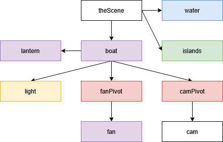
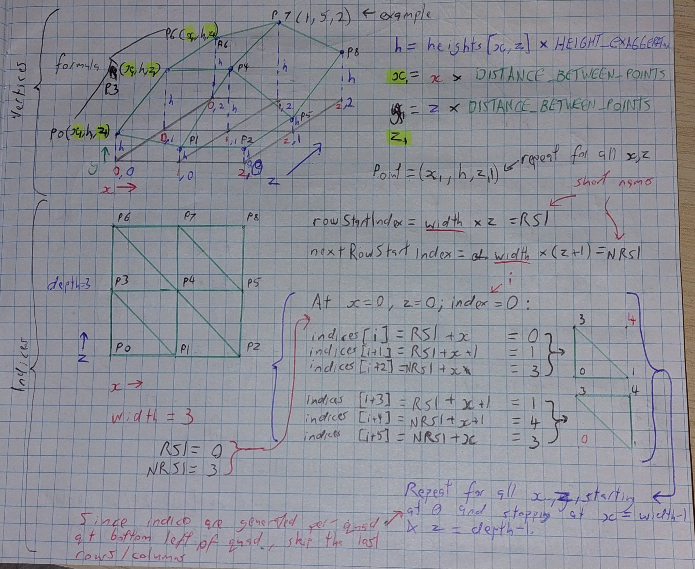
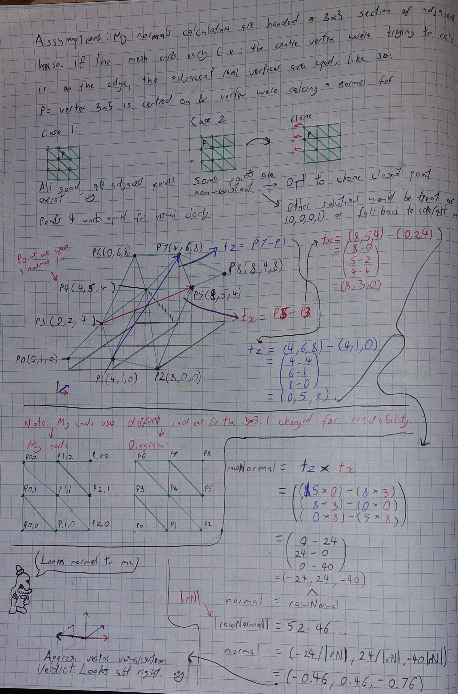
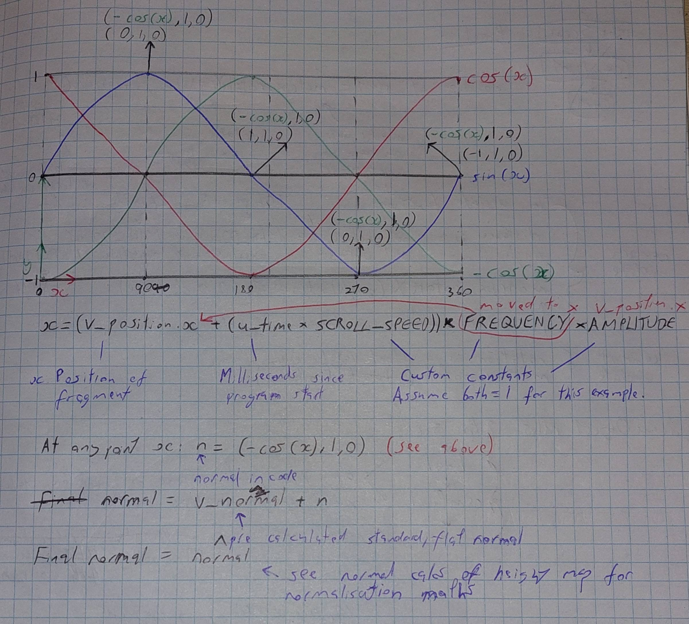
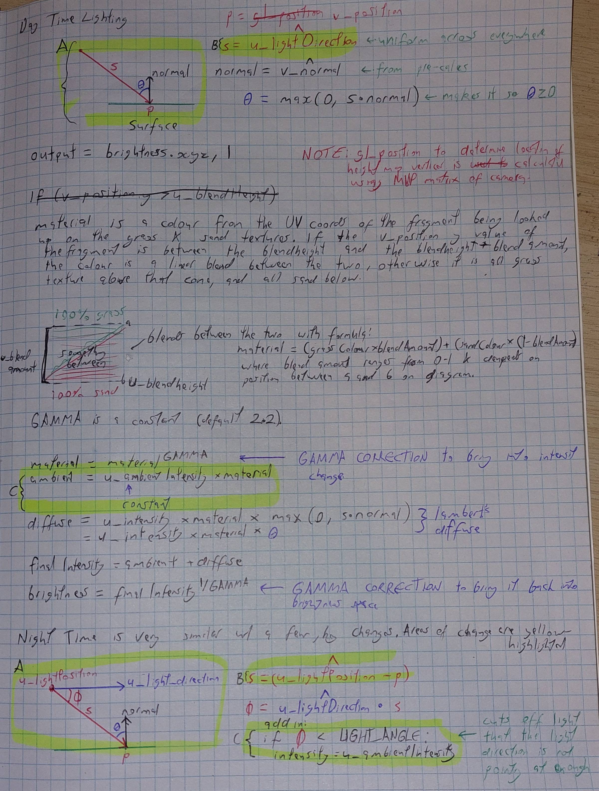
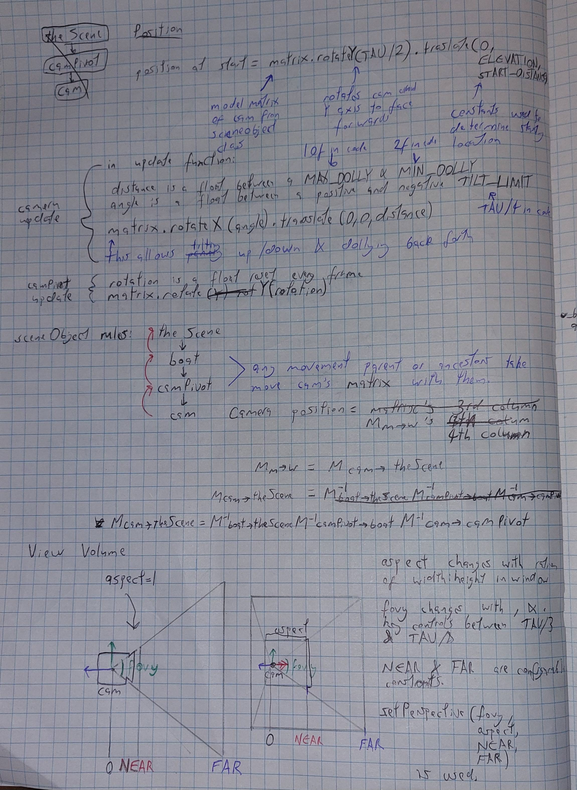

# COMP3170 Assignment 1 Report
### Student Name: Rowan Murdoch Clarke
### Student ID: 46971270

## Your Development Environment
|Spec|Answer|
|----|-----|
|Java JDK version used for compilation|18.0.2|
|Java compiler compliance level used for compilation|18|
|Java JRE version used for execution|18+36-2087|
|Eclipse version|4.24.0.I20220607-0700|
|Your screen dimensions (width x height)|2560 x 1440|
|Your computer type (Mac/PC)|PC|
|Your computer make and model|Custom-AMD Ryzen 5 3500X|
|Your computer Operating System and version|Windows 10 10.0.19045 Build 19045|

## Features Attempted
Complete the table below indicating the features you have attempted. This will be used as a guide by your marker for what elements to look for, and dictate your <b>Completeness</b> mark.

| Feature | Weighting | Attempted Y/N |
|---------|-----------|---------------|
| General requirements | 3% | Y |
| Debug - Wireframe mode | 3% | Y |
| Debug - Normals mode | 3% | Y |
| Debug - UV mode | 3% | Y |
| Boat - Mesh | 3% | Y |
| Boat - Normals | 3% | Y |
| Boat - UVs & Textures | 4% | Y |
| Boat - Spinning Fan | 4% | Y |
| Boat - Movement | 4% | Y |
| Height Map - Mesh | 4% | Y |
| Height Map - Normals | 4% | Y |
| Height Map - UVs & Textures | 4% | y |
| Height Map - Texture blending | 4% | Y |
| Water - Mesh & Normals | 2% | Y |
| Water - Transparency | 4% | Y |
| Water - Ripples | 4% | Y |
| Water - Fresnel effect* | 4% | Y |
| Lighting - Sun | 8% | Y |
| Lighting - Headlamp | 8% | Y |
| Cameras - Third-person | 4% | Y |
| **Total** | 80% | - |

# Documentation

Documentation is marked separately from implementation, but should reflect the approach taken in your code. You can attempt documentation questions for features you have not implemented or completed, but should clearly indicate that this is the case.

Documentation should include both diagrams and relevant equations to explain your solution. **Note**: Merely copying images from the lecture notes or other sources will get zero marks (and may be treated academic misconduct).

Where requested, meshes should be drawn to scale in model coordinates, including:
* The origin
* The X and Y axes
* The coordinates of each vertex
* The triangles that make the mesh

## Scene Graph (2%)

* Include a drawing (pen-and-paper or digital) of the scene graph used in your project.

 

## Height Map (6%)

* Illustrate how you construct the height map mesh, including both the vertex positions and index buffer, using a 3x3 example. (3%)

 

* Explain how you calculate the normal for one vertex in your mesh. Provide an appropriate diagram as well as the relevant equations used in the calculation. (3%)

 

## Water - Ripples (3%)

* Explain how fragment normal is calculated for the water surface, to implement the ripple effect. Provide an appropriate diagram as well as the relevant equations used in the calculation. (3%)

I changed my code to be more correct AFTER drawing this diagram. Here is the corrected line (as my pen corrections are not super clear):

* x = ((v_position.x x FREQUENCY) + (u_time x SCROLL_SPEED) x AMPLITUDE

## Lighting (6%)

* Explain how the day-time lighting value for a point on the height map is calculated, using the third-person camera. Provide an appropriate diagram as well as the relevant equations used in the calculation. (3%)

* Explain how the night-time lighting value for a point on the height map is calculated, using the third-person camera. Provide an appropriate diagram as well as the relevant equations used in the calculation. (3%)

Lighting has been combined as they share many complex similiarities (texture lookup colour blending, gamma correction, basic diffuse lighting, etc). Hopefully the highlighted difference areas are clear enough.
For difference C, although there are new lines of code  they take place after the code "ambient = U_ambientIntensity + material", which still occurs.

It also wasn't clear how to do these in relation to the 3rd person camera - we are explicitely told not to calculate specular for this mesh so the camera position is entirely irrelevant (except for where on the screen to render the fragment, but that is handled by the MVP matrix...)

## Camera (3%)

I apologise for the mistakes and attempts to correct made in this one. Comprehensive documentation is alot of work and I waited until I was fairly certain my code would not change much until attempting much of it.
Due to space constraints, several function lines are split into multiple lines in a method I hope is clear.
For some of the messier lines, I have re-typed them:
* Camera position = Mm->w's 4th column.
* Mcam->theScene = M-1boat->theScene M-1camPivot->boat M-1cam>camPivot

*  Illustrate how you calculate the position and view volume of the third-person camera. (3%)

